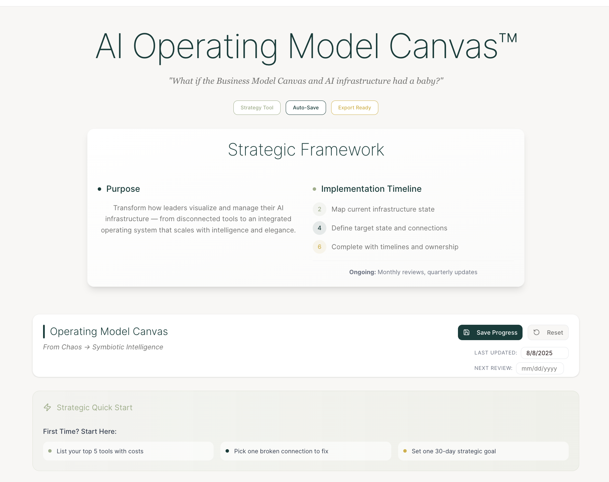

# AI Operating Model Canvas

**A strategic blueprint for orchestrating AI adoption in small and mid-sized enterprises.**

The **AI Operating Model Canvas** is a visual tool designed by **Nadis Intelligence™** to help leadership teams map, align, and evolve their AI infrastructure.  
It is the central framework used in our consulting, diagnostics, and workshops.

---

## Canvas Preview

> *For the interactive version, view the live demo → [AI Operating Model Canvas Live Demo](https://canvas.nadis.ai)*

---

## Purpose
The canvas helps teams:
- Audit **current AI tools** and how they’re connected
- Identify **gaps** in data flow, decision support, and team adoption
- Align AI investments with **business objectives**
- Create a **coherent operating model** instead of a fragmented tool stack

---

## How to Use

1. **Map Your Tools**  
   Document all AI and non-AI tools your organization currently uses.  
   Place them in the relevant functional blocks.

2. **Identify Infrastructure Layers**  
   Align tools and processes with the **Three Symbioses™**:  
   - **Cognitive** (decision-making, insights, AI reasoning)  
   - **Operational** (process automation, workflow orchestration)  
   - **Strategic** (alignment with long-term goals and market position)

3. **Spot Gaps**  
   Highlight areas with redundancy, missing connections, or unclear ownership.

4. **Plan Interventions**  
   Define experiments, integrations, or retirements to strengthen your model.

---

## Related Resources

- [The Three Symbioses™ Framework](./framework-3-symbioses.md)  
- [Infrastructure Checklist Template](../templates/infrastructure-checklist.json)  
- [Signal Input Schema](../templates/signal-input-schema.json)

---

**Author:** Ariana Abramson, MSc  
Founder & AI Infrastructure Strategist – Nadis Intelligence  
[https://nadis.ai](https://nadis.ai)
